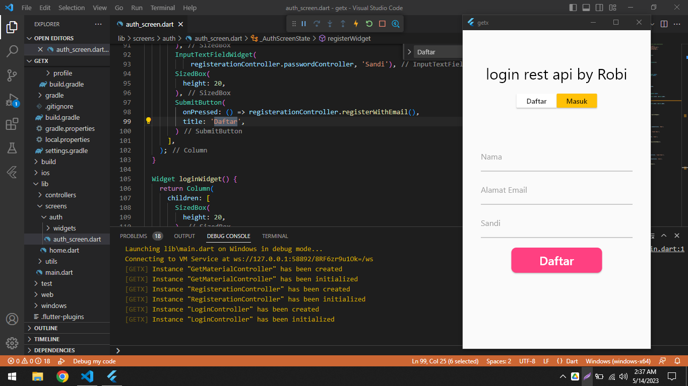
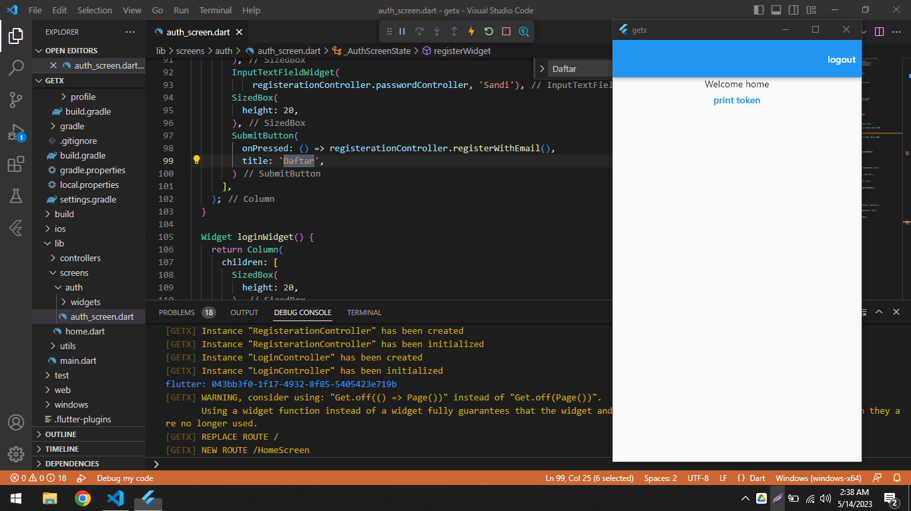

# Flutter DummyRest Api by ROBIYANTO
# UTS PERTEMUAN SEMESTER 4

| Nama : |ROBIYANTO|                  |
Pemrograman M0bile 2 


Flutter adalah kerangka kerja pengembangan aplikasi lintas platform yang dikembangkan oleh Google. Dengan menggunakan Flutter, Anda dapat membuat antarmuka pengguna (UI) yang menarik dan responsif untuk aplikasi iOS, Android, dan web. Flutter sangat populer untuk mengembangkan aplikasi seluler lintas platform karena memiliki banyak fitur dan kemampuan yang kuat.

Materi tentang Flutter login page dengan REST API dummy menggunakan Visual Studio Code melibatkan penggunaan Flutter untuk membuat tampilan halaman login yang berinteraksi dengan REST API dummy untuk melakukan otentikasi pengguna. Di bawah ini adalah langkah-langkah umum untuk membuat login page dengan Flutter dan REST API dummy menggunakan Visual Studio Code:

Langkah 1: Persiapan Lingkungan
- Pastikan Anda telah menginstal Flutter SDK dan mengatur PATH Flutter.
- Instal Visual Studio Code dan ekstensi Flutter dan Dart.

Langkah 2: Membuat Proyek Flutter Baru
- Buka terminal Visual Studio Code.
- Jalankan perintah `flutter create nama_proyek` untuk membuat proyek Flutter baru.
- Beralih ke direktori proyek dengan menjalankan perintah `cd nama_proyek`.

Langkah 3: Menambahkan Dependensi
- Buka file pubspec.yaml pada direktori proyek.
- Tambahkan dependensi http dengan versi tertentu. Contoh:
```yaml
dependencies:
  flutter:
    sdk: flutter
  http: ^0.13.4
```
- Jalankan perintah `flutter pub get` di terminal untuk mengambil dependensi.

Langkah 4: Membuat Halaman Login
- Buka file main.dart pada direktori lib.
- Hapus kode default yang ada di dalamnya dan gantikan dengan kode berikut:
```dart
import 'package:flutter/material.dart';
import 'package:http/http.dart' as http;
import 'dart:convert';

void main() => runApp(MyApp());

class MyApp extends StatelessWidget {
  @override
  Widget build(BuildContext context) {
    return MaterialApp(
      title: 'Login Page',
      theme: ThemeData(
        primarySwatch: Colors.blue,
      ),
      home: LoginPage(),
    );
  }
}

class LoginPage extends StatefulWidget {
  @override
  _LoginPageState createState() => _LoginPageState();
}

class _LoginPageState extends State<LoginPage> {
  final TextEditingController _usernameController = TextEditingController();
  final TextEditingController _passwordController = TextEditingController();

  Future<String> _login() async {
    var url = 'https://api.example.com/login'; // Ganti dengan URL REST API Anda
    var response = await http.post(
      url,
      body: {
        'username': _usernameController.text,
        'password': _passwordController.text,
      },
    );

    if (response.statusCode == 200) {
      var jsonResponse = json.decode(response.body);
      var token = jsonResponse['token'];
      return token;
    } else {
      throw Exception('Failed to login');
    }
  }

  @override
  Widget build(BuildContext context) {
    return Scaffold(
      appBar: AppBar(
        title: Text('Login Page'),
      ),
      body: Padding(
        padding: EdgeInsets.all(16.0),
        child: Column(
          children: <Widget>[
            TextFormField(
              controller: _usernameController,
              decoration: InputDecoration(labelText: 'Username'),
            ),
            TextFormField(
              controller: _passwordController,
              decoration: InputDecoration(labelText: 'Password'),
              obscureText: true,
            ),
            SizedBox(height: 24.0),
            ElevatedButton(
              child: Text

<p>Screenshoot</P>







